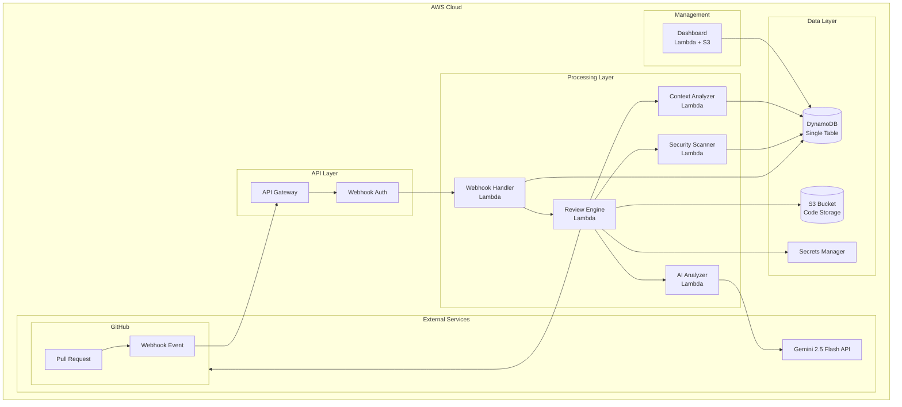

# Design Document: AI-Powered Serverless Code Review System

## Overview

The AI-powered serverless code review system is architected as a fully serverless solution on AWS, leveraging Gemini 2.5 Flash for intelligent code analysis. The system processes GitHub webhook events through API Gateway and Lambda functions, performs comprehensive code analysis using AI, and provides actionable feedback directly on Pull Requests.

The architecture prioritizes cost optimization (targeting $0.00/month within free tiers), scalability through serverless patterns, and comprehensive analysis capabilities including security scanning, architectural review, and policy enforcement.

## Architecture

### High-Level Architecture



### Component Interaction Flow

1. **Webhook Reception**: GitHub sends PR events to API Gateway
2. **Authentication**: Webhook signature validation using GitHub secret
3. **Event Processing**: Webhook Handler Lambda processes and queues analysis
4. **Code Retrieval**: Review Engine fetches PR diff and file contents
5. **Parallel Analysis**: AI Analyzer, Security Scanner, and Context Analyzer process code
6. **Result Aggregation**: Review Engine combines analysis results
7. **Feedback Delivery**: Comments posted to GitHub PR via API
8. **Data Persistence**: Results stored in DynamoDB for dashboard analytics

## Components and Interfaces

### 1. API Gateway and Webhook Handler

**Purpose**: Receive and validate GitHub webhook events

**Interface**:
- **Input**: API Gateway event containing GitHub webhook payload
- **Output**: HTTP response with status code and processing confirmation
- **Authentication**: HMAC-SHA256 signature validation using GitHub webhook secret
- **Processing**: Asynchronous trigger to Review Engine with validated payload

**Key Features**:
- HMAC-SHA256 signature validation
- Event filtering (only PR opened/updated/synchronize)
- Rate limiting and error handling
- Asynchronous processing trigger

### 2. Review Engine (Orchestrator)

**Purpose**: Coordinate the entire code review process

**Interface**:
- **Input**: GitHub PR webhook payload with repository and change information
- **Output**: ReviewResult containing aggregated analysis findings
- **Coordination**: Manages parallel execution of AI Analyzer, Security Scanner, and Context Analyzer
- **Integration**: GitHub API client for fetching PR diffs and posting comments

**Responsibilities**:
- GitHub API integration for fetching PR diffs
- Coordination of parallel analysis components
- Result aggregation and prioritization
- Comment formatting and posting
- Error handling and retry logic

### 3. AI Analyzer

**Purpose**: Perform comprehensive code analysis using Gemini 2.5 Flash

**Interface**:
- **Input**: List of changed files with diffs and content
- **Output**: AIAnalysisResult with architectural findings and recommendations
- **AI Integration**: Gemini 2.5 Flash API for intelligent code analysis
- **Prompt Engineering**: Optimized prompts for code review scenarios

**Analysis Capabilities**:
- Architectural pattern recognition
- Code quality assessment
- Best practice validation
- Performance optimization suggestions
- Maintainability analysis

### 4. Security Scanner

**Purpose**: Detect security vulnerabilities and OWASP Top 10 issues

**Interface**:
- **Input**: List of changed files for security analysis
- **Output**: SecurityScanResult with vulnerability findings and severity ratings
- **Detection Methods**: Pattern matching, static analysis, and rule-based scanning
- **Rule Engine**: Configurable security rules for different vulnerability types

**Security Checks**:
- Hardcoded secrets detection (API keys, passwords, tokens)
- SQL injection vulnerability patterns
- Authentication/authorization flaws
- OWASP Top 10 vulnerability patterns
- Insecure cryptographic practices

### 5. Context Analyzer

**Purpose**: Perform cross-file architectural analysis

**Interface**:
- **Input**: Changed files and existing codebase context
- **Output**: ContextAnalysisResult with architectural impact assessment
- **Analysis Scope**: Cross-file dependency analysis and architectural pattern recognition
- **Context Management**: Maintains understanding of broader system architecture

**Analysis Features**:
- Dependency impact analysis
- Architectural pattern recognition
- Cross-file consistency checking
- Design principle validation
- Refactoring recommendations

### 6. Attribution Service

**Purpose**: Determine code ownership and contribution patterns

**Interface**:
- **Input**: Repository identifier and file path
- **Output**: FileAttribution with authorship information and contribution metrics
- **Data Sources**: Git blame API and commit history metadata
- **Privacy**: Configurable anonymization and privacy settings

### 7. Policy Engine

**Purpose**: Enforce team-specific coding standards and policies

**Interface**:
- **Input**: Repository configuration and analysis results
- **Output**: PolicyEvaluationResult with policy violations and enforcement actions
- **Configuration**: YAML/JSON policy definitions with team-specific rules
- **Enforcement**: Severity-based merge blocking and notification system

## Data Models

### DynamoDB Single Table Design

The system uses a single DynamoDB table with the following access patterns:

**Primary Key Structure**:
- **PK (Partition Key)**: Entity type and identifier
- **SK (Sort Key)**: Sub-entity or timestamp
- **GSI1PK/GSI1SK**: Global Secondary Index for alternative access patterns

**Entity Types**:

```python
# Pull Request Reviews
PK: "PR#{repo_owner}#{repo_name}#{pr_number}"
SK: "REVIEW#{timestamp}"
Attributes: {
    "status": "pending|completed|failed",
    "analysis_results": {...},
    "created_at": "2024-01-15T10:30:00Z",
    "updated_at": "2024-01-15T10:35:00Z"
}

# Repository Configuration
PK: "REPO#{repo_owner}#{repo_name}"
SK: "CONFIG"
Attributes: {
    "webhook_secret": "encrypted_secret",
    "policies": {...},
    "team_settings": {...}
}

# Team Analytics
PK: "TEAM#{team_id}"
SK: "ANALYTICS#{date}"
Attributes: {
    "reviews_count": 42,
    "issues_found": 156,
    "time_saved_hours": 24.5,
    "top_contributors": [...]
}

# Security Findings
PK: "SECURITY#{repo_owner}#{repo_name}"
SK: "FINDING#{finding_id}"
Attributes: {
    "severity": "critical|high|medium|low",
    "type": "sql_injection|secrets|auth",
    "file_path": "src/auth.py",
    "line_number": 42,
    "status": "open|resolved"
}
```

**Access Patterns**:
1. Get PR review by repository and PR number
2. List all reviews for a repository
3. Get repository configuration
4. Query security findings by repository
5. Get team analytics by date range
6. List active security findings across repositories


## Correctness Properties

*A property is a characteristic or behavior that should hold true across all valid executions of a system-essentially, a formal statement about what the system should do. Properties serve as the bridge between human-readable specifications and machine-verifiable correctness guarantees.*

Let me analyze the acceptance criteria to determine which ones can be tested as properties:

Based on the prework analysis, the following properties validate the system's correctness:

### Property 1: Webhook Processing Timeliness
*For any* GitHub Pull Request webhook event, the Review_Engine should be triggered within 30 seconds of webhook receipt, ensuring responsive code review initiation.
**Validates: Requirements 1.1**

### Property 2: Analysis Result Delivery
*For any* completed code analysis, the system should post comments directly to the corresponding GitHub Pull Request, ensuring feedback reaches developers.
**Validates: Requirements 1.2**

### Property 3: Exponential Backoff Behavior
*For any* API rate limit or external service failure, the system should implement exponential backoff with increasing delays between retry attempts.
**Validates: Requirements 1.3, 10.1**

### Property 4: Comprehensive Error Handling
*For any* system error (authentication failures, timeouts, API failures), the system should log detailed information and return appropriate status codes or fallback behavior.
**Validates: Requirements 1.4, 2.4, 4.4, 10.2, 10.5**

### Property 5: Multi-Repository Support
*For any* repository configuration, the system should support independent webhook endpoints and policy configurations without cross-repository interference.
**Validates: Requirements 1.5, 7.5**

### Property 6: AI Analysis Integration
*For any* code submission, the AI_Analyzer should process it using Gemini 2.5 Flash API and maintain context across all files in the Pull Request.
**Validates: Requirements 2.1, 2.5**

### Property 7: Comprehensive Security Detection
*For any* code analysis, the Security_Scanner should detect SQL injection vulnerabilities, hardcoded secrets, authentication flaws, and OWASP Top 10 issues, categorizing them by severity.
**Validates: Requirements 3.1, 3.2, 3.3, 3.4, 3.5**

### Property 8: Attribution Accuracy
*For any* Pull Request changes, the Attribution_Service should use Git blame to identify authors and provide proportional attribution for multi-author files.
**Validates: Requirements 4.1, 4.2, 4.3**

### Property 9: Cross-File Context Analysis
*For any* Pull Request with multiple files, the Context_Analyzer should examine all files together and identify cross-file dependencies and architectural patterns.
**Validates: Requirements 5.1, 5.2, 5.3, 5.4, 5.5**

### Property 10: Dashboard Data Accuracy
*For any* dashboard query, the system should return accurate metrics including review hours saved, contributor statistics, and support proper filtering by date ranges and repositories.
**Validates: Requirements 6.2, 6.3, 6.4, 6.5**

### Property 11: Policy Enforcement
*For any* team-defined policies in YAML or JSON format, the Policy_Engine should validate code against rules and block Pull Request merging based on violation severity.
**Validates: Requirements 7.1, 7.2, 7.3, 7.4**

### Property 12: Performance Requirements
*For any* Pull Request, the system should complete analysis within 2 minutes for small PRs (< 10 files) and within 10 minutes for large PRs (> 50 files), with incremental feedback for large PRs.
**Validates: Requirements 9.1, 9.2**

### Property 13: Concurrent Processing
*For any* multiple simultaneous Pull Request submissions, the system should process them concurrently up to Lambda limits and queue additional requests with estimated completion times.
**Validates: Requirements 9.3, 9.4**

### Property 14: Graceful Degradation
*For any* external service unavailability (GitHub API, AI service), the system should queue requests for later processing or provide fallback analysis results.
**Validates: Requirements 2.3, 10.3, 10.4**

## Error Handling

### Error Categories and Responses

**1. GitHub API Errors**
- Rate limiting: Exponential backoff with jitter
- Authentication failures: Log and return 401
- Service unavailability: Queue webhooks for retry

**2. AI Service Errors**
- Quota exhaustion: Queue for later processing
- Analysis failures: Fallback to static analysis
- Timeout: Partial results with continuation

**3. AWS Service Errors**
- DynamoDB throttling: Exponential backoff
- Lambda timeouts: Graceful partial processing
- S3 failures: Retry with alternative storage

**4. Validation Errors**
- Invalid webhook signatures: Reject with 403
- Malformed payloads: Log and return 400
- Configuration errors: Default to safe settings

### Error Recovery Strategies

**Exponential Backoff Implementation**:
- Base delay: 1 second
- Maximum delay: 60 seconds  
- Jitter: 10% random variation
- Maximum retries: 3 attempts

**Circuit Breaker Pattern**:
- Failure threshold: 5 consecutive failures
- Recovery timeout: 30 seconds
- Half-open state testing: Single request validation

**Graceful Degradation Levels**:
1. **Full Service**: All analysis components operational
2. **Reduced Service**: AI analysis disabled, static analysis only
3. **Minimal Service**: Basic webhook processing and queuing
4. **Emergency Mode**: Error logging and status reporting only

## Testing Strategy

### Dual Testing Approach

The system employs both unit testing and property-based testing for comprehensive coverage:

**Unit Tests**:
- Specific webhook payload examples
- Known security vulnerability samples
- Edge cases for attribution logic
- Dashboard rendering with sample data
- Error condition simulations

**Property-Based Tests**:
- Universal properties across all inputs
- Randomized webhook payloads
- Generated code samples with known patterns
- Comprehensive input coverage through randomization
- Minimum 100 iterations per property test

### Property-Based Testing Configuration

**Framework**: Hypothesis (Python)
**Configuration**:
- Minimum 100 iterations per property test
- Each test tagged with: **Feature: ai-code-review-system, Property {number}: {property_text}**
- Timeout: 30 seconds per property test
- Shrinking enabled for minimal failing examples

**Example Property Test Structure**:
- **Framework**: Hypothesis (Python) for property-based testing
- **Test Configuration**: 100+ iterations per property with 30-second timeout
- **Shrinking**: Enabled for minimal failing examples
- **Coverage**: Randomized inputs with comprehensive edge case generation
- **Tagging**: Each test tagged with feature name and property reference

### Integration Testing

**GitHub Webhook Integration**:
- Mock GitHub API responses
- Test webhook signature validation
- Verify comment posting functionality

**AI Service Integration**:
- Mock Gemini API responses
- Test prompt generation and parsing
- Verify fallback mechanisms

**AWS Service Integration**:
- LocalStack for DynamoDB testing
- S3 mock for file operations
- Lambda local testing environment

### Performance Testing

**Load Testing**:
- Concurrent webhook processing
- Large Pull Request handling
- Memory usage optimization
- Cold start mitigation

**Benchmarking**:
- Analysis completion times
- API response latencies
- Database query performance
- Cost per review calculation

### Security Testing

**Vulnerability Assessment**:
- Webhook signature validation
- Input sanitization testing
- Secrets management verification
- Access control validation

**Penetration Testing**:
- API endpoint security
- Injection attack prevention
- Authentication bypass attempts
- Data exposure risks

This comprehensive testing strategy ensures the system meets all requirements while maintaining high reliability and performance standards within the AWS free tier constraints.